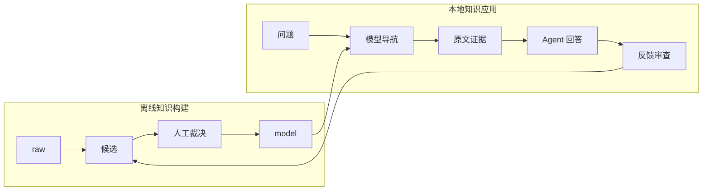

# LLM 领域知识库项目

## 项目定位

本项目把一组领域原始资料整理为可审查的知识模型，并验证这些模型能否帮助桌面 Agent 更准确、更快速、更可追溯地回答真实问题。

当前不是通用 Skill 成品，也不是独立 GUI。当前交付形态是一个本地项目：业务员通过桌面 Agent 自然语言提问，开发者通过本地脚本复现知识选择、证据定位、对照评测和反馈回流。

## 当前阶段

| 模块 | 状态 | 权威证据 |
|---|---|---|
| 50 篇原始资料准入 | Verified | `registry/source_manifest.yaml` |
| 场景/概念/实体模型构建 | Verified | `model/`、`runs/build/2026-09-23/validation.json` |
| 模型结构与引用校验 | Verified | `scripts/validate_model.py` |
| 本地知识上下文检索 | Verified | `scripts/kb_context.py`、`tests/` |
| Raw 与模型导航自动对照 | Verified as seed baseline | `runs/evaluation/retrieval-seed-v1/`；题集仍需人工确认 |
| 最终回答质量 | Pending verification | 需要业务员在桌面 Agent 中逐题评分 |
| MCP 与正式 Skill | Rejected for current stage | 见 `docs/adr/002-application-validation-before-mcp.md` |

## 两条主流程

应用反馈不会自动修改正式模型。它先进入 `registry/application_feedback_queue.yaml`，经过人工审核后，才可能更新别名、来源、场景、概念或回答规则。

## 使用入口

- 业务员：阅读 `topics/knowledge-application.md`，在桌面 Agent 中按自然语言提问。
- 开发者：阅读 `WORKLOG.md`，运行 `scripts/kb_context.py` 和 `scripts/evaluate_retrieval.py`。
- 知识维护者：阅读 `MEMORY.md`、`registry/` 和相关 ADR。
- 历史构建过程：见 `runs/build/2026-09-23/`。

## 当前边界

- 支持本地 Markdown 语料和现有 Scenario–Concept–Entity 模型。
- 当前检索是可解释的轻量字符 n-gram 检索，不依赖向量数据库。
- 最终自然语言答案由桌面 Agent 生成，本地脚本只返回知识上下文和证据候选。
- 尚未实现 MCP、HTTP 服务、多人权限、GUI 和自动模型 API 调用。
