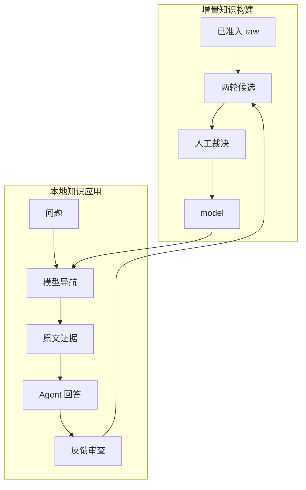

# LLM 领域知识库项目

## 项目定位

本项目把一组领域原始资料整理为可审查的知识模型，并验证这些模型能否帮助桌面 Agent 更准确、更快速、更可追溯地回答真实问题。

当前交付为 v1.5 本地知识建设与应用工作台、桌面 Agent 配套 JSON CLI。维护者从 Raw 准入、两轮候选、人工审查完成增量知识建设，也可编辑节点和审查证据；业务员通过桌面 Agent 提问。根目录 AGENTS.md 和 tools 操作契约提供定向入口，当前没有安装个人 Skill 或 MCP。

## 当前阶段

| 模块 | 状态 | 权威证据 |
|---|---|---|
| 50 篇原始资料准入 | Verified | `registry/source_manifest.yaml` |
| 场景/概念/实体模型构建 | Verified | `model/`、`runs/build/2026-09-23/validation.json` |
| 模型结构与引用校验 | Verified | `scripts/validate_model.py` |
| 本地知识上下文检索 | Verified | `scripts/kb_context.py`、`tests/` |
| Raw 与模型导航自动对照 | Verified as seed baseline | `runs/evaluation/retrieval-seed-v1/`；题集仍需人工确认 |
| 最终回答质量 | Pending verification | 需要业务员在桌面 Agent 中逐题评分 |
| GUI 一跳 / 全局视图 / 证据统一 / trace 与评价 | Verified by automated checks | `gui/`、`tests/test_studio_v14.py`、`runs/build/studio-v1.4/verification.md` |
| 现有局部图 / 主动多跳 / 编辑回滚 | Verified by automated checks | `tests/test_studio.py`、`runs/build/studio-v1.4/verification.md` |
| 资料接入 / 两轮候选 / 审查发布 / 来源复核 / Agent 操作 | Automated implementation checks; business semantics pending | `scripts/kb_build.py`、`tests/test_knowledge_build.py`、`runs/build/studio-v1.5/verification.md` |
| MCP 与正式 Skill | Rejected for current stage | 见 `docs/adr/002-application-validation-before-mcp.md` |

## 两条主流程

应用反馈不会自动修改正式模型。它先进入 `registry/application_feedback_queue.yaml`，经过人工审核后，才可能更新别名、来源、场景、概念或回答规则。

## 使用入口

- 业务员：阅读 `topics/knowledge-application.md`，在桌面 Agent 中按自然语言提问。
- 开发者：阅读 `WORKLOG.md`，运行 `scripts/kb_context.py` 和 `scripts/evaluate_retrieval.py`。
- 知识维护者：阅读 `docs/studio-guide.md`、`MEMORY.md`、`registry/` 和相关 ADR。
- 历史构建过程：见 `runs/build/2026-09-23/`。

## 模块定位

| 流程 | GUI / Agent 入口 | 代码 | 文档 |
|---|---|---|---|
| 资料、候选、发布、更新 | 资料与知识建设 / `kb_manage.py` | `scripts/kb_build.py`、`gui/frontend/construction.js` | `docs/knowledge-construction.md`、`application/agent-operations.md` |
| 问答检索 | 一跳检索 / `kb_context.py` | `scripts/kb_lib.py` | `application/assistant_prompt.md` |
| 字段证据与人工维护 | 知识浏览 / 本机 API | `scripts/kb_evidence.py`、`gui/backend/studio.py` | `docs/studio-guide.md` |
| 全局关系与路径 | 全局、关系、多跳 / `kb_multihop.py` | `gui/backend/studio.py` | `docs/studio-guide.md` |
| 调用评价与反馈 | 运行记录 / 反馈 CLI | `scripts/kb_trace.py`、`record_feedback.py`、`sync_feedback_queue.py` | `topics/knowledge-application.md` |

Agent 从 [AGENTS.md](AGENTS.md) 和 [操作指南](application/agent-operations.md) 开始；运行 `python scripts/kb_manage.py tools` 发现参数。建设步骤见 [建设手册](docs/knowledge-construction.md)。资料任务保存在 runs/build/knowledge，问答 trace 在 runs/evaluation。原有历史构建和框架文档继续保留。

## 当前边界

- 建设支持本地 Markdown/文本及现有 Scenario–Concept–Entity 模型，问答沿用已准入来源检索。
- 当前检索是可解释的轻量字符 n-gram 检索，不依赖向量数据库。
- 最终自然语言答案由桌面 Agent 生成，本地脚本只返回知识上下文和证据候选。
- 已增加仅监听本机的 GUI HTTP 服务，操作见 `docs/studio-guide.md`。
- 当前主检索为场景到直接知识的一跳流程；GUI 展示后续关系预览，主动多跳仍仅沿明确引用展开。
- 人工确认限于登记支持范围；GUI 与 CLI 共用段落状态。运行回放与反馈边界见 ADR 005。
- 未实现 MCP、多人权限、自动模型 API 调用或 Onto-Model 六类扩展。

完整 IPO/decomposition 参与主问答留待下期；当前 GUI 公开实际 JSON 与较短文本摘要。merge 登记别名供建设目录，不改变问答召回；来源删除不会自动删知识，冲突需人处理。

本轮范围见 [ADR 006](docs/adr/006-incremental-knowledge-construction.md)，应用边界继续见 ADR 005。具体操作从建设手册或工作台手册开始。
