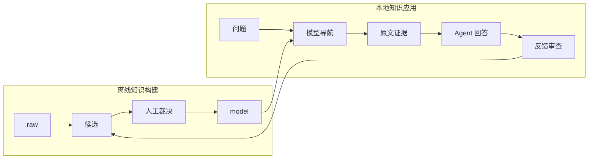

# LLM 领域知识库项目

## 项目定位

本项目把一组领域原始资料整理为可审查的知识模型，并验证这些模型能否帮助桌面 Agent 更准确、更快速、更可追溯地回答真实问题。

当前交付形态为本地知识工作台和桌面 Agent 配套 CLI。维护者通过 GUI 浏览、人工编辑正式模型和审查证据，业务员通过桌面 Agent 提问，开发者通过脚本复现查询、评测和反馈。不是通用 Skill 成品。

## 当前阶段

| 模块 | 状态 | 权威证据 |
|---|---|---|
| 50 篇原始资料准入 | Verified | `registry/source_manifest.yaml` |
| 场景/概念/实体模型构建 | Verified | `model/`、`runs/build/2026-09-23/validation.json` |
| 模型结构与引用校验 | Verified | `scripts/validate_model.py` |
| 本地知识上下文检索 | Verified | `scripts/kb_context.py`、`tests/` |
| Raw 与模型导航自动对照 | Verified as seed baseline | `runs/evaluation/retrieval-seed-v1/`；题集仍需人工确认 |
| 最终回答质量 | Pending verification | 需要业务员在桌面 Agent 中逐题评分 |
| GUI 一跳 / 全局视图 / 证据统一 / trace 与评价 | Verified by automated checks | `gui/`、`tests/test_studio_v14.py`、`runs/build/studio-v1.4/verification.md` |
| 现有局部图 / 主动多跳 / 编辑回滚 | Verified by automated checks | `tests/test_studio.py`、`runs/build/studio-v1.4/verification.md` |
| MCP 与正式 Skill | Rejected for current stage | 见 `docs/adr/002-application-validation-before-mcp.md` |

## 两条主流程

应用反馈不会自动修改正式模型。它先进入 `registry/application_feedback_queue.yaml`，经过人工审核后，才可能更新别名、来源、场景、概念或回答规则。

## 使用入口

- 业务员：阅读 `topics/knowledge-application.md`，在桌面 Agent 中按自然语言提问。
- 开发者：阅读 `WORKLOG.md`，运行 `scripts/kb_context.py` 和 `scripts/evaluate_retrieval.py`。
- 知识维护者：阅读 `docs/studio-guide.md`、`MEMORY.md`、`registry/` 和相关 ADR。
- 历史构建过程：见 `runs/build/2026-09-23/`。

## 当前边界

- 支持本地 Markdown 语料和现有 Scenario–Concept–Entity 模型。
- 当前检索是可解释的轻量字符 n-gram 检索，不依赖向量数据库。
- 最终自然语言答案由桌面 Agent 生成，本地脚本只返回知识上下文和证据候选。
- 已增加仅监听本机的 GUI HTTP 服务，操作见 `docs/studio-guide.md`。
- 当前主检索为场景到直接知识的一跳流程；GUI 展示后续关系预览，主动多跳仍仅沿明确引用展开。
- 人工确认限于登记支持范围；GUI 与 CLI 共用段落状态。运行回放与反馈边界见 ADR 005。
- 未实现 MCP、多人权限、自动模型 API 调用或 Onto-Model 六类扩展。

本轮范围及决策见 [ADR 005](docs/adr/005-one-hop-first-observable-studio.md)。具体操作从 [工作台手册](docs/studio-guide.md) 开始。
