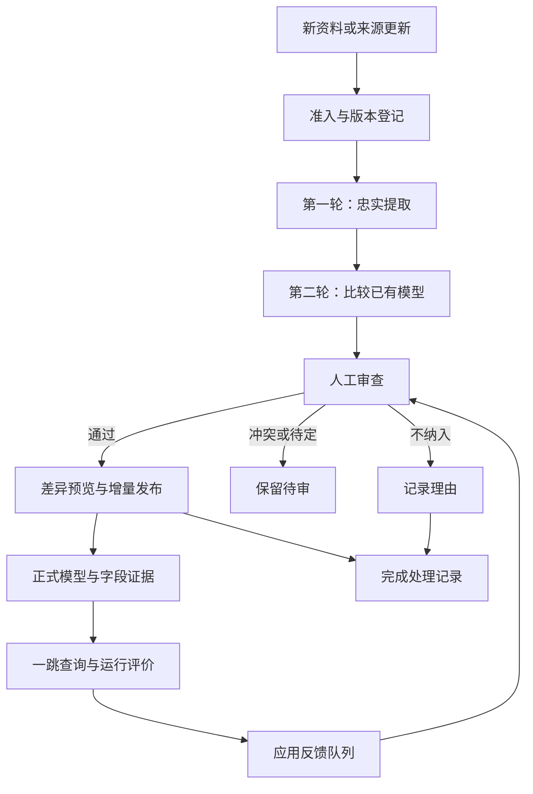

# v1.5 资料到正式知识

本期把历史人工构建方式变成可重复执行的增量流程：人定义框架，Agent 提取与比较，人审查，Python 校验并发布。程序不会自动调用 LLM；桌面 Agent 通过任务包工作。问答仍使用 v1.4 的一跳检索。

## 流程与位置

应用反馈队列与资料候选队列仍分别保存；反馈不会自动转换成候选。本图的反馈回路由人判断是否新建资料任务或维护节点。

| 模块 | GUI 位置 | 代码 / Agent 操作 | 保存位置 |
|---|---|---|---|
| 接入与准入 | 资料与知识建设 → 资料 | `scripts/kb_build.py`；`sources.*` | `raw/inbox/`、`raw/accepted/`、`registry/source_manifest.yaml` |
| 版本与处理状态 | 资料表、扫描变化 | `sources.list/scan/read` | `registry/knowledge_build.yaml`、`runs/build/knowledge/source_versions/` |
| 第一轮提取 | 当前任务 → 第一轮 | `jobs.create/packet/extract` | `runs/build/knowledge/jobs/<job_id>/` |
| 第二轮比较 | 当前任务 → 第二轮 | `catalog`、`jobs.packet/compare` | 同一任务的 `job.json`、`models.json` |
| 候选审查 | 候选卡片 → 通过/拒绝/待定 | `jobs.get/review` | `job.json` 中的 review |
| 预览与发布 | 检查差异 → 发布 | `jobs.preview/publish` | `model/*.yaml`、`registry/gui_evidence.yaml`、`registry/aliases.yaml` |
| 中断恢复 | 写入记录；Agent 入口 | `publications.list/recover` | `runs/build/knowledge/publications/<publication_id>/` |
| 知识调用 | 一跳检索 | `scripts/kb_context.py` | `runs/evaluation/<trace_id>/` |
| 评价与反馈 | 运行记录 | `record_feedback.py`、`sync_feedback_queue.py` | trace 的反馈及 `registry/application_feedback_queue.yaml` |

旧 inventory_sources.py 的默认清单写入已转到同一 sources.scan；自定义 --output 仅导出盘点副本。project_status.py 也显示资料处理、建设任务和未完成写入，避免 .txt 或拒绝资料产生不同统计口径。

Agent 入口是根目录 AGENTS.md，详细请求见 [操作说明](../application/agent-operations.md)。知识建设记录与查询 trace 分开保存。

## 1. 接入资料

打开“资料与知识建设”，选择 .md/.txt 文件，或填写文件名与原文，然后点“导入资料”。文件进入 raw/inbox，尚未准入。也可以直接把本地资料放入 raw/inbox，再点“扫描变化”。文件名需普通名称，不含目录；GUI 导入单文件最多 600 KB、250,000 字符。

先打开资料阅读原文，填写准入说明，再选择“准入”或“不纳入”。准入会移动到 raw/accepted 并登记；不纳入会保留原文与决定。相同内容再次导入会返回现有记录；同名不同内容拒绝覆盖。扫描能报告同内容的不同文件，暂不自动合并来源。

仅 .md/.txt 进入提炼任务。扫描可以展示其他格式，但本期没有 PDF/Word/OCR 转换。已有 accepted 来源不能直接撤回：删除或迁移前需人工核对正式模型引用影响。

## 2. 创建两轮任务

勾选 1–20 份已准入文本，创建任务。任务冻结完整原文与三份模型的版本及模型内容；每项原文都能按行回查。进入第一轮后导出任务包，交给桌面 Agent 读取判据并提取，结果 JSON 可粘贴回页面，或由 Agent 用 CLI 提交。

第一轮不要求匹配既有节点，避免旧名称改变原文理解；每条 observations 给出类型、名称、定义和完整行证据。框架无法表达的内容写 question，不能编造 IPO。没有有效候选也可提交空列表并写原因。

第二轮导出比较包。Agent 先读目录，再读取相关完整节点，判断新增、补充字段、补充证据、合并名称、冲突或不纳入。全部第一轮候选必须有归宿；同一目标的修改合为一条建议。涉及新节点互相引用时可同批提交，发布仍检查引用目标是否已通过。

## 3. 人工审查

每张卡片显示原文、支持字段、建议理由和完整建议节点；合并名称显示别名。人判断类型是否合理、与已有知识是否相同、原文能否支持字段、新增条件是否真实。通过/拒绝/待定都是独立决定，拒绝和待定要写理由。冲突不能直接通过，需在新任务中解决后再形成正式变化。

不需要把所有相关段落都确认。发布的支持登记来自已通过候选中明确选择的 supports，而不是召回候选全集。它进入 GUI 与 CLI 共用的字段证据机制；一个段落可支持多个字段，逐字段撤销只移除相应登记。

重新导入相同比较结果保留审查；改动结果会重置未发布决定。已发布任务不能重新提取或改写比较结果，应新建任务。任务与全部决定保留，不覆盖历史。

## 4. 预览并增量发布

点“检查并预览发布差异”，核对模型差异、支持范围、别名和涉及文件，再点发布。程序检查模型、来源、登记版本和引用；只发布已通过项，仅替换受影响 YAML 条目，保留其他节点与文件头。被替换条目的排版和注释可能重新序列化。

只补证据也会把新来源补入目标的 sources。merge 保留现有 id，登记 aliases；当前别名用于建设目录，尚未接入问答召回。字段证据登记会参与现有 GUI/CLI 检索的状态展示与有限排序偏好，不意味着确认了所有回答。

有待审或待定项时可部分发布，但资料不会标为处理完成。全部候选已裁决后才更新 processed_sha256；全部拒绝、或有理由的无候选任务，可以完成且不修改模型。已完成重复发布不新增记录。

## 状态如何理解

准入与知识处理是两条独立状态：accepted 只说明资料可用，不说明内容已提炼。

| 处理状态 | 含义 | 下一步 |
|---|---|---|
| 未处理 | 无处理基线 | 创建任务 |
| 待提取 / 待比较 | 已有两轮任务 | 导出对应任务包、提交结果 |
| 候选待审 | 比较已保存 | 逐条裁决、预览 |
| 部分已发布 | 已通过项落盘，仍有待审项 | 完成剩余审查 |
| 已处理 | 本版本任务全部完成 | 保留记录，未来变化再处理 |
| 需更新 / 文件缺失 | 当前内容与处理版本不同或文件不存在 | 查看引用影响，恢复资料或新建任务 |

历史 v1.4 数据没有两轮增量任务：有模型 sources 引用且与 manifest 基线一致的资料标为“历史模型引用 / 已处理”。这是兼容导入的基线，不是本轮重新审过 50 篇资料。没有自动补造历史审查。

## 来源更新与复核

更新已有资料时保持原路径，在本地编辑 raw/accepted 原文，再刷新或扫描。新内容显示“需更新”，旧全文快照继续保留；相关字段确认会按来源哈希失效。资料详情列出受影响节点。选中更新后的来源创建新任务，Agent 比较新版本与现有模型，经过同样审查发布。

旧任务遇到来源或任一正式模型版本变化，发布会被阻止。当前采用保守的整文件基线检查，即使改的是其他节点也需新建任务重新比较。不要通过改哈希绕过复核。来源删除不自动删除知识或来源引用，本期没有自动撤回/全量重建。

## 写入与恢复

写入共用 registry/.knowledge-write.lock，防止 GUI 与 CLI 同时修改；外部编辑器不共享该锁，仍需版本检查。多个文件的一次变化先保存 before/after 与 manifest，正常异常会尝试补偿恢复；意外进程终止会留下 prepared 或 recovery_required。

出现这类记录后停止继续写入，通过写入记录或 publications.list 查看，再执行 publications.recover。恢复只在当前文件等于记录的 before/after 时回退；发现其他外部变化则拒绝覆盖，保留现场供人工比对。它用于恢复中断写入，不是已提交业务更新的任意回滚工具。

进程强制终止可能留下写锁。确认所有旧写入进程已停止后，移除 registry/.knowledge-write.lock 再恢复；不要在活动进程写入时删锁。committed 历史通过 Git/人工复核后的新候选修正，原有单节点 GUI 保存历史仍有自己的保护回滚。

## 本期与下期

本期实现资料、候选、审查、发布与版本复核闭环。知识框架扩展、Agent 自动 API 调度、完整字段参与问答、语义多跳与业务评测自动化留待后续。本期结构测试不能代替候选语义质量和最终答案的人工评测。
