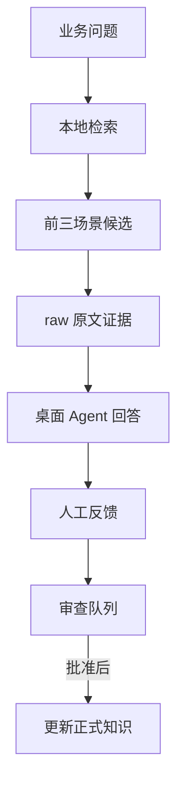

# 本地运行、测试与迭代手册

## 1. 这套版本构建成了什么

v1.3 已增加知识维护 GUI，见 [工作台手册](studio-guide.md)。本页继续说明桌面 Agent 的 CLI 应用、评测与反馈，不是聊天 GUI、Skill 或 MCP 服务。Python 工具负责确定性地定位候选场景、展开知识项、回查 raw 原文并保存 trace；桌面 Agent 负责理解语义、必要时澄清和组织最终答案。



这样做的原因是：当前自动种子评测的 Top3 召回率明显高于 Top1，一步自动分类还不可靠；先保留 Agent 的语义判断和人工审查，再决定是否包装成 MCP。

## 2. 首次安装与健康检查

要求 Python 3.10+。在项目根目录执行：

```bash
python -m pip install -r requirements.txt
python scripts/project_status.py .
python scripts/validate_model.py .
python -m unittest discover -s tests -v
```

预期基线：50 个 accepted 来源、17 个场景、234 个概念、163 个实体、0 个断裂引用、7 个自动测试通过。校验器当前还会报告两个结构质量警告，它们已进入待审队列，不是运行失败。

## 3. 在 WorkBuddy / 桌面 Agent 中触发

把解压后的项目目录作为工作目录或可读目录，然后输入：

```text
请先读取 application/assistant_prompt.md，并严格按其中规则使用本项目知识库回答：
面对复杂业务故障时，如何定位根因？
```

正确行为是：Agent 调用 `scripts/kb_context.py`，检查前三候选与证据，必要时用 `--scenario` 重取上下文，再输出带来源和 `trace_id` 的回答。只读取文件、直接凭通用知识回答，不算使用了本项目闭环。

如果桌面 Agent 不能执行命令，先人工运行：

```bash
python scripts/kb_context.py \
  --question "面对复杂业务故障时，如何定位根因？" \
  --mode model-guided --json
```

再把 JSON 结果交给 Agent，并要求它遵守 `application/response_contract.yaml`。

## 4. 开发者的三种测试

### 单题检索

```bash
python scripts/kb_context.py --question "如何构建个人知识体系？" --json
```

输出会保存到 `runs/evaluation/<trace_id>/`。`context_ready`、`needs_clarification` 和 `no_evidence` 都是正常业务结果。

### Raw 基线对照

```bash
python scripts/kb_context.py --question "如何构建个人知识体系？" --mode raw --json
```

不要只比较“有没有结果”，应比较场景是否正确、来源是否支撑、关键点是否完整、无依据扩写是否减少。

### 固定题集回归

```bash
python scripts/evaluate_retrieval.py . --run-id retrieval-YYYYMMDD
```

`eval/questions.yaml` 当前是待人工确认的种子题，不是金标准。当前基线记录在 `runs/evaluation/retrieval-seed-v1/`。

## 5. 把应用体会回流到知识构建

先找到回答中的 `trace_id`，再记录反馈：

```bash
python scripts/record_feedback.py . \
  --trace-id TRACE_ID \
  --rating partial \
  --issue wrong_scenario \
  --expected-scenario "如何分析和解决复杂问题" \
  --notes "用户描述的是根因定位，不是系统架构"

python scripts/sync_feedback_queue.py .
```

审查 `registry/application_feedback_queue.yaml`。不同问题应进入不同修改面：

| 反馈类型 | 优先检查 | 常见修改 |
|---|---|---|
| 场景选错 | 场景定义、触发条件、候选词 | `model/scenarios.yaml` 或别名规则 |
| 缺知识 | 概念/实体覆盖 | `model/concepts.yaml`、`model/entities.yaml` |
| 来源不对 | 模型到来源关系 | 对应 `sources`，必要时补 raw |
| 无依据扩写 | 回答约束 | `application/assistant_prompt.md` |
| 回答不完整 | 场景 phase 或响应合同 | 场景 composition、`response_contract.yaml` |
| 越界误答 | 拒答/澄清阈值 | `scripts/kb_lib.py`，并补边界测试 |

任何反馈都不得由脚本直接改正式模型。审查批准后再修改，并把决定写入 `registry/review_decisions.yaml` 或 ADR。

## 6. 加入新的 raw 资料

1. 将新文件放入 `raw/inbox/`，不要直接覆盖 `raw/accepted/`。
2. 运行 `python scripts/inventory_sources.py .`，检查重复文件和哈希。
3. 人工审查来源、范围、质量与许可；通过后将文件移到 `raw/accepted/`。
4. 让 Agent 对比现有模型，先提出“新增、合并、更新、拒绝”候选，不直接写正式 YAML。
5. 审查候选后，增量修改受影响的场景、概念、实体和来源关系。
6. 重新运行来源清单、模型校验、自动测试、种子评测和人工业务题。
7. 在 `WORKLOG.md` 和 `runs/build/<日期或批次>/` 留下输入、裁决、输出和验证记录。

应用反馈与新 raw 是两种不同证据：前者说明“哪里不好用”，后者说明“知识内容是否有依据”。修改正式知识时，两者都要检查。

## 7. 发布前检查

```bash
python scripts/inventory_sources.py .
python scripts/validate_model.py .
python -m unittest discover -s tests -v
python scripts/evaluate_retrieval.py . --run-id release-candidate
python scripts/package_project.py . --output ../LLM-knowledgeBase.zip
```

只有在真实业务问题经过人工确认、模型导航相对 Raw 基线出现稳定收益、错误可通过 trace 复现时，才进入 MCP 设计阶段。
