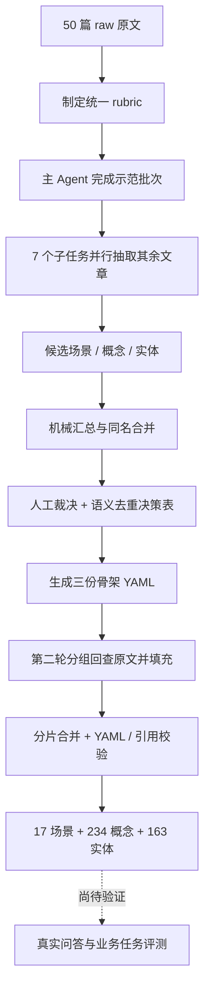
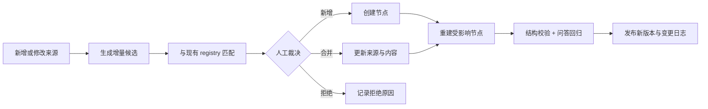
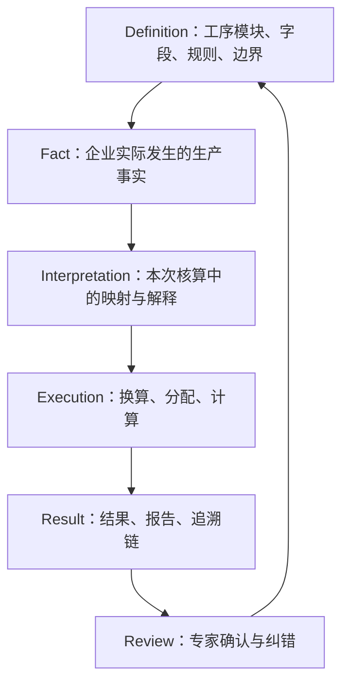

# LLM 知识元模型：WorkBuddy 实际执行复盘、审查机制与领域迁移方法

## 0. 结论先行

该项目已经完成了一个较完整的**知识元模型构建流水线**：50 篇原始文章经过统一判据、示范批次、并行抽取、候选汇总、人工裁决、语义去重、骨架生成、第二轮内容填充、分片合并和结构校验，最终形成：

- 场景 `scenarios.yaml`：17 条；
- 概念 `concepts.yaml`：234 条；
- 实体 `entities.yaml`：163 条；
- IPO 处理步骤：958 步；
- 概念与实体关系引用：1638 条；
- 失效引用：0；
- 明确标记“证据不足”的概念：3 条。

它已证明“LLM 语义加工 + 文件化中间产物 + Python 确定性合并校验”可以完成中等规模的知识建模。但当前闭环仍停在**知识模型构建完成**，尚未从运行记录中看到一套真实知识问答评测、业务任务评测或增量更新演练。因此，它现在更准确的定位是：

> 一个已经跑通建模阶段的知识工程流水线，而不是已经验证效果的知识问答系统。

对后续迭代最重要的不是立即增加向量数据库或图数据库，而是补齐三件事：

1. 将人工审查从零散裁决升级为明确的 Review Gate；
2. 将“来源文件级追溯”提升为“具体观点—原文片段级追溯”；
3. 建立真实问题集，验证模型是否真的改善检索、回答和业务执行。

---

## 1. 本次分析的证据边界

本次判断结合了两类材料：

1. 前一版项目中的《知识萃取规范指南》《知识问答提示词》和 README，用于理解设计目标；
2. 本次压缩包中的 `.workbuddy/memory/2026-09-23.md`、`task_plan.md`、`progress.md`、`findings.md`、两轮 rubric、批次结果、去重决策表、合并脚本以及最终三份 YAML，用于还原实际执行。

需要注意：`.workbuddy` 中只有一份约 5 KB 的执行记忆摘要，并不是逐次工具调用、完整提示词和全部模型输出组成的事件日志。`task_plan.md`、`progress.md` 和 `findings.md` 主要反映其中一个批次任务。因此，下面能够确认的是**产物链和关键操作**，不能据此完整还原每一轮模型内部推理。

---

## 2. 项目实际完成了什么

### 2.1 设计目标

原始文章不是直接拿来“全库塞给模型”，而是被整理成三个层次：

| 层次 | 回答的问题 | 最终字段 |
|---|---|---|
| 场景 Scenario | 用户在什么情况下要解决什么问题 | `trigger`、`goal`、`composition`、`inputs`、`outputs` |
| 概念 Concept | 解决问题需要哪些可复用的思维加工单元 | `define`、`ipo`、`decomposition`、`relations` |
| 实体 Entity | 过程中涉及哪些具体的人、书、工具、技术或具名框架 | `category`、`type`、`relations`、`children` |

问答设计则反向使用这些结构：先匹配场景，再沿概念和实体定位来源，最后回到 `raw/` 原文组织答案。

### 2.2 实际控制流



### 2.3 实际数据流

```text
文章段落
→ 候选名称 + 定义 + 来源文件
→ 跨批次候选全集
→ 合并 / 改名 / 删除决策
→ 只有基础字段的骨架对象
→ IPO / decomposition / relations / composition
→ 可被问答流程读取的三份规范化 YAML
```

### 2.4 各执行主体的分工

| 环节 | LLM / Agent | Python | 人 | 文件的作用 |
|---|---|---|---|---|
| 判据制定 | 将长指南压缩为批次操作规范 |  | 确认边界 | `_round1_rubric.md` |
| 候选抽取 | 阅读文章并做语义分类 | 统计数量 | 抽查示范结果 | `_round1_batch*.md` |
| 候选汇总 |  | 解析表格、合并完全同名项 |  | `_round1_candidates.json` |
| 语义去重 | 提出合并、删除和改名 | 按决策重建 | 裁决高歧义项 | `_round1_dedup_map.md` |
| 第二轮填充 | 回查来源并生成 IPO、关系和场景阶段 | 分派、合并、结构校验 | 审查语义忠实性 | `_round2_part*.yaml` |
| 最终发布 |  | 校验引用、生成规范 YAML | 签署版本 | `model/*.yaml` |

这是项目目前最值得学习的地方：**语义判断交给模型，重复执行与结构完整性交给代码，关键边界交给人，所有阶段通过文件衔接。**

---

## 3. 从实际记录还原的完整执行步骤

### 3.1 准备统一抽取判据

长篇规范被压缩为 `_round1_rubric.md`，明确：

- 场景必须是文章实际回答的“如何……”问题；
- 概念必须能够形成 IPO 或拆成 2–6 个子步骤；
- 具名框架、人物、书籍和工具归入实体；
- 每篇文章场景 0–3、概念 3–8、实体 2–8；
- 第一轮只登记候选，不展开 IPO；
- 跨批次重复暂不处理。

这一步不是普通 Prompt 优化，而是在建立**标注手册**。它决定后面所有 Agent 是否使用同一套分类口径。

### 3.2 先做示范批次，再并行扩量

主 Agent 先对 4 篇文章完成批次 1，产出 `_round1_progress.md`；后续子任务明确要求阅读 rubric 和示范结果，再处理其分配的文章。

这构成了一个实际的少样本机制：

```text
抽取规则（rubric）
+ 已完成的标准样例（batch 1）
+ 当前待处理文章
→ 子任务输出同结构候选
```

它不是自动检索或动态生成 Few-shot，也没有根据文章类型选择不同示例；本质上是**固定示范样本 + 统一规则**。

### 3.3 批次并行抽取

剩余 46 篇文章被拆为 7 个批次并行处理。每个子任务拥有：

- 本批次原文；
- 统一 rubric；
- 批次 1 示例；
- 固定输出表格；
- 明确的数量范围和禁止事项。

并行任务不直接写同一个最终 YAML，而是各写一个独立批次文件。这避免了多人同时修改主文件造成冲突。

### 3.4 汇总与统计

`_round1_merge.py` 只负责机械动作：解析 8 个批次文件、合并完全同名项、保存 JSON 和面向人的汇总表。语义相近但名字不同的候选没有在代码中自动合并。

第一轮累计候选：

| 层次 | 原始候选 | 完全同名去重后 |
|---|---:|---:|
| 场景 | 72 | 72 |
| 概念 | 390 | 325 |
| 实体 | 247 | 182 |

“场景 72 个完全不重名”被日志正确识别为坏信号：不同 Agent 用不同措辞表达了相近问题，后续语义去重压力很大。

### 3.5 人工裁决与语义去重

运行记录中明确保存了 3 项人工裁决：

1. 静态结构 / 动态结构并入结构化思维；
2. 因果自洽 / 关系自洽 / 过程自洽作为逻辑自洽的三个维度；
3. 满意解 / 幅度决策并入系统思维 IPO。

在此基础上，Agent 形成 `_round1_dedup_map.md`，记录每次合并、删除、类型覆盖和理由，再由 `_round1_build_yaml.py` 重建骨架。最终完成：

- 场景 72 → 17；
- 概念 325 → 234；
- 实体 182 → 163。

“决策表”和“生成脚本”分离是非常正确的设计：需要修订语义判断时，应改决策表并重建，而不是直接手工修改最终 YAML。

### 3.6 第二轮内容填充

第二轮新建 `_round2_rubric.md`，要求每个概念至少有 IPO 或 decomposition，关系可解析，并以原文为依据。

随后：

- `_round2_plan.py` 根据主来源文章所属批次分配 234 个概念和 163 个实体；
- 主 Agent 完成批次 1，其他批次由并行子任务完成；
- 每个子任务只写自己的 `_round2_partN.yaml`；
- `_round2_merge.py` 将分片合入骨架；
- 场景单独分成 3 组填充，由 `_round2_scen_merge.py` 合并。

第二轮再次使用了“主 Agent 示范批次”，但从任务文件看，其他批次主要拿到 rubric、待填列表和全量可引用 ID；没有看到一个独立的“自动 Few-shot 提示生成器”。

### 3.7 校验、报错与修复

实际执行遇到两个典型问题：

- 人工生成的关系引用了第一轮已被合并掉的旧 ID；
- YAML 合并脚本缩进错误，文本看似完整，解析后 `ipo` 和 `relations` 结构却已损坏。

项目通过 `yaml.safe_load` 和引用解析检查发现并修复，说明：

> 生成 YAML 后，“文件写出来了”不能作为成功标准；必须重新解析并检查字段结构、类型和引用。

---

## 4. 当前成果的质量判断

### 4.1 已经可靠的部分

本次重新解析三份最终 YAML 后确认：

- 17 / 234 / 163 个 ID 均无重复；
- 50 篇原文全部至少被概念或实体引用；
- 所有 `sources` 路径真实存在；
- 所有 `concept://`、`entity://` 和场景 `uses` 均可解析；
- 所有概念都有 IPO 或 decomposition；
- 所有实体至少有一项关系；
- 场景均有 4–6 个 phase。

这些结论证明的是**结构完整性与可执行性**。

### 4.2 仍需人工审查的部分

结构统计暴露出四类语义风险：

1. **弱关系占比高。** 1638 条概念/实体关系中，`related_to` 有 1116 条，约占 68%；163 个实体中有 99 个只有 `related_to`。这意味着图谱虽然连接很多，但大量边只表示“有关”，难以支持精确推理。
2. **场景可能组装过重。** 17 个场景共引用 378 次概念或实体，平均每个场景约 22 个 `uses`。作为写作纲要尚可，作为业务执行流程会过重。
3. **证据不足标记可能偏少。** 234 个概念中只有 3 个标记证据不足。考虑到很多文章是观点性长文，不太可能每个候选都天然具有完整、明确的 IPO，建议抽样核查是否存在为了满足 Schema 而补全步骤的情况。
4. **溯源仍停留在文件级。** `sources` 能告诉人“来自哪篇文章”，不能直接指出某个定义、步骤或关系来自哪个标题、段落和原句。

此外，规范要求关系控制在 2–6 条；按“关系目标数量”统计，有 8 个条目超过 6。这里也暴露了“条”究竟指关系类型还是目标链接数的口径歧义，需要在下一版 rubric 中明确。

### 4.3 尚未验证的部分

当前包中没有看到：

- 一组真实用户问题及期望来源；
- 场景命中率、概念召回率或引用正确率；
- 有元模型与无元模型的问答对比；
- 新文章增量更新的完整演练；
- 使用者对答案帮助程度的反馈。

因此不能仅凭 YAML 完整就宣称知识问答效果已经得到验证。

---

## 5. 整个流程中，哪些地方需要人审查

人不需要逐字复核所有模型产出。应把精力放在**不可逆、高影响、模型难以自行证明**的决策上。

| Gate | 审查对象 | 为什么必须由人把关 | 建议动作 |
|---|---|---|---|
| G0 语料准入 | 新增原文、版本、版权、可信度 | 垃圾来源会污染全部下游 | 接受 / 隔离 / 拒绝；记录版本与用途 |
| G1 建模边界 | 场景、概念、实体的定义及枚举 | 分类口径一旦偏移会批量产生错误 | 用 5–10 个边界案例验证 rubric |
| G2 示范样本 | 第一批人工样例 | 后续 Agent 会复制其风格与错误 | 逐项核对来源、粒度、定义和分类 |
| G3 候选质量 | 存疑项、低置信项、异常高产文章 | 防止空壳概念和无意义实体进入候选池 | 接受 / 改名 / 降级 / 删除 |
| G4 合并与删除 | 所有 merge / split / drop | 错误合并会丢失语义差异，后续难以发现 | 全量审查决策表，而非抽样 |
| G5 内容填充 | IPO、decomposition、精确关系 | 结构可以通过校验，但步骤可能是模型补写 | 审高中心性节点、弱证据项和随机样本 |
| G6 场景组装 | trigger、goal、phase、uses、例外 | 决定最终问答或业务流程如何执行 | 用真实问题走读端到端路径 |
| G7 发布验收 | 回归问题集、来源、输出 | 判断知识模型是否真正有用 | 通过才发布新版本 |

### 5.1 每条内容应怎样审

建议审查界面或表格至少展示：

| 字段 | 作用 |
|---|---|
| `candidate_id` | 当前候选名称 |
| `layer` | 场景 / 概念 / 实体 |
| `proposed_action` | 接受 / 改名 / 合并 / 拆分 / 删除 / 待补证据 |
| `target_id` | 合并后的目标 ID |
| `source_path` | 来源文件 |
| `source_heading` | 对应章节标题 |
| `evidence_excerpt` | 支持当前判断的短原文片段 |
| `rationale` | 模型为何提出此判断 |
| `reviewer_decision` | 人工裁决 |
| `reviewer_note` | 裁决理由 |
| `reviewed_at` | 审查时间 |

审查时连续追问五个问题：

1. 原文真的说了这件事，还是模型为了补齐结构进行了推演？
2. 这是可独立调用的概念，还是父概念的一个步骤、属性或例子？
3. 与已有节点相比，输入、处理和输出是否真正不同？
4. 关系能否写成更精确的 `depends_on / contains / uses / produces`，还是只有模糊相关？
5. 这个节点会不会被某个真实场景调用？如果永远不会，是否值得保留？

### 5.2 审查优先级

知识文章场景可采用风险抽样：

- 100% 审查所有合并、拆分和删除；
- 100% 审查所有“证据不足”和分类存疑项；
- 100% 审查每个场景；
- 100% 审查被多个场景频繁引用的枢纽概念；
- 其余 IPO 与关系随机抽查 10%–20%。

但在碳核算等专业业务中，系统边界、活动数据、排放因子、分配规则、单位换算和最终数值必须 100% 审核或由确定性规则验证，不能沿用普通知识文章的抽样比例。

---

## 6. 后续如何维护与更新

### 6.1 不要每次全量重跑

维护应采用增量闭环：



### 6.2 建议调整目录

当前 `model/` 同时放最终模型、批次结果、任务文件、脚本和临时分片，长期会越来越难辨认。建议重组为：

```text
knowledge-base/
├── raw/
│   ├── inbox/                 # 新进入、尚未审核
│   └── accepted/              # 已准入的稳定来源
├── model/
│   ├── scenarios.yaml         # 唯一正式版本
│   ├── concepts.yaml
│   └── entities.yaml
├── registry/
│   ├── aliases.yaml           # 同义词与旧 ID
│   ├── review_decisions.yaml  # 合并、删除、拆分裁决
│   └── source_manifest.yaml   # 来源版本、哈希、状态
├── examples/                  # 经人工确认的少样本金标准
├── eval/
│   ├── questions.yaml         # 回归问题与期望来源
│   └── runs/                  # 每次评测结果
├── runs/
│   └── 2026-09-23/            # 批次文件、分片与过程日志归档
├── scripts/
│   ├── build_model.py
│   ├── validate_model.py
│   └── evaluate_qa.py
└── CHANGELOG.md
```

不要立即删除现有过程文件；先将本次结果冻结为一个 run，再让 `model/` 只保留正式发布物。

### 6.3 更新 SOP

每次新增文章建议执行：

1. 将文件放入 `raw/inbox/`，登记来源、时间、作者、版本和用途；
2. 只对新文件执行第一轮抽取；
3. 先按别名表和现有 ID 做确定性匹配，再让 LLM 提出语义候选；
4. 人工决定新增、合并、拆分或拒绝；
5. 只重建新增节点和其直接依赖节点；
6. 对受影响的场景重新组装；
7. 运行 Schema、路径、引用、循环、重复 ID 和字段类型校验；
8. 运行固定问题集，比较旧版与新版；
9. 发布版本并记录新增、修改、删除及影响范围。

### 6.4 维护频率

- 每次入库：增量抽取、裁决、结构校验；
- 每月：检查重复概念、孤立节点、`related_to` 过度使用和失效来源；
- 每季度：检查场景是否仍与真实问题匹配，清理无人调用的节点；
- 规则或业务标准变化时：立即进行受影响范围分析与回归测试。

---

## 7. 可迁移到其他领域的通用方法

原项目的“场景—概念—实体”适合观点文章和知识问答，但不是所有领域都应机械套三层。真正可迁移的是下面七层闭环：

| 通用层 | 核心问题 | 典型产物 |
|---|---|---|
| 1. Source / Evidence | 依据来自哪里 | 原始文件、网页、表格、图片、版本与权限 |
| 2. Fact | 原始资料明确表达了什么事实 | 带出处的事实原子、字段值、事件记录 |
| 3. Semantic Registry | 这些事实涉及哪些稳定对象和术语 | 对象、概念、别名、关系、Schema |
| 4. Rule / Procedure | 应如何判断、转换和执行 | 规则、SOP、公式、约束、异常分支 |
| 5. Scenario / Workflow | 谁在什么条件下解决什么问题 | 触发、角色、输入、阶段、输出、审批 |
| 6. Tool Execution | 哪些动作必须确定性完成 | API、SQL、Python、计算器、文件转换 |
| 7. Review / Evaluation | 如何证明结果可靠且有用 | 人工 Gate、校验器、金标准、回归问题 |

当前知识库项目主要覆盖第 1、3、4、5 层，部分覆盖第 7 层；它没有显式事实层，也没有实际工具执行层。迁移到业务系统时，需要补上这两层。

### 7.1 通用实施流程

1. 明确最终任务，而不是先决定要做知识图谱；
2. 盘点输入来源、权限、更新频率和可信度；
3. 定义目标 Schema 与边界案例；
4. 选择少量代表资料制作人工金标准；
5. LLM 生成候选，代码做结构校验；
6. 人工确认高影响语义决策；
7. 用决策表生成正式模型；
8. 用真实任务和失败案例评测；
9. 只在简单检索无法满足规模后再引入向量召回、rerank 或图数据库。

---

## 8. 少样本在其他领域应该怎样设计

### 8.1 当前项目真实使用的少样本机制

当前项目不是“系统自动生成 Few-shot Prompt”，而是：

- 主 Agent 先做批次 1；
- 子任务阅读 rubric；
- 子任务参考批次 1 的输出格式和粒度；
- 再处理各自的新文章。

这是一个有效的冷启动方式，但存在风险：示范批次如果错，错误会被规模化复制。

### 8.2 通用少样本库的构成

不要随机挑几条“看起来不错”的例子。每类任务至少准备：

- 3–5 个常规正例；
- 2–3 个边界例；
- 1–2 个负例或应拒绝例；
- 1 个多来源冲突例；
- 1 个缺失信息、必须中断或请求确认的例子。

一个合格样例应包含：

```yaml
task: factor_matching
input_excerpt: 原始输入片段
expected_output: 期望结构化结果
evidence: 支持结果的来源位置
rationale: 为什么这样判定
common_wrong_answer: 常见错误结果
why_wrong: 错误原因
reviewer: 专家或审核人
version: 1.0
```

### 8.3 少样本应按任务拆分

不同环节需要不同示范，不要把所有例子塞进一个超长 Prompt：

- 抽取样本：如何从原文形成候选；
- 分类样本：概念、实体、事实、规则的边界；
- 去重样本：何时合并、何时保留差异；
- 关系样本：如何选择精确关系；
- 场景样本：如何从对象与规则组装流程；
- 异常样本：证据不足、冲突、缺字段时如何中断。

### 8.4 模型能否自己生成少样本

LLM 可以从历史材料中**提出样本候选**，但正式 Few-shot 应由人确认后进入 `examples/`。尤其在专业业务中，未经审核的模型自生成样例不能再作为下一轮模型的“标准答案”，否则会形成错误自强化。

另需保留一批从未进入 Prompt 的测试样本，避免“用训练示例证明自己正确”。

---

## 9. 迁移到纺织产品碳足迹核算场景

你的目标不是构建一个只会解释知识的问答库，而是构建一个**能够把企业资料转换为可复算核算结果的受控工作流**。因此，当前项目只能作为知识组织和 Agent 编排参考，不能原样复制。

### 9.1 建议的业务模型



| 层 | 你的项目中的对象 | 主要执行者 |
|---|---|---|
| Definition | 产品、工段、工序模块、活动类型、单位、边界、分配规则 | 专家定义，系统维护 |
| Evidence | ERP/MES/Excel/PDF/图片/IoT 原始记录 | 文件系统、解析工具 |
| Fact | 某订单何时在哪个设备完成何种活动、消耗多少资源 | LLM 抽取候选，代码校验 |
| Interpretation | 事实属于哪个工序模块、采用哪个边界和分配逻辑 | LLM 候选 + 规则过滤 + 人确认 |
| Factor | 候选排放因子及地域、年份、技术、单位边界 | 检索与排序工具 + 专家批准 |
| Execution | 单位换算、分配、乘法与汇总 | 确定性 Python |
| Result | 工序、工段、产品排放及证据链 | 代码生成，模型解释 |

### 9.2 当前三层如何映射

| 当前项目 | 碳核算中的对应物 | 注意事项 |
|---|---|---|
| Scenario | 核算业务场景或工作流 | 必须增加角色、触发、审批、异常、完成条件 |
| Concept | 核算方法、匹配规则、分配方法 | 能代码化的规则应转为确定性规则，不只给模型阅读 |
| Entity | 产品、工序、设备、物料、因子库、标准 | 要区分 Definition 与实际 Instance |
| Sources | 企业材料与标准 | 应追溯到文件页码、表格、行列或记录 ID |
| IPO | 处理步骤 | 明确哪些由 LLM、代码和专家执行 |

### 9.3 适合你的少样本金标准

优先围绕你已有 RQ 和金标准建立：

- 工序识别：标准名称存在、名称缺失、跨记录关联、上下游乱序；
- 活动数据：文本、表格、混合输入、重复字段、冲突字段；
- 因子匹配：地域不符、年份过旧、单位不兼容、系统边界不一致；
- 中断样本：缺因子、缺单位、结构化值与叙述冲突；
- 工具调用：单位换算、非乘法运算、分配计算；
- 人工裁决：Q011 蒸汽来源、YKK 拉链 EF-022、结构化字段优先等已确认规则。

这些样例不只是帮助模型“学会输出格式”，而是明确告诉系统：什么时候可以继续，什么时候必须停下来让核算人员确认。

### 9.4 最轻量实施顺序

**P0：先让核算链可信**

- 固定 Definition / Fact / Interpretation / Result 四类对象；
- 每个事实携带 evidence pointer；
- 工序链和活动数据异常进入审核队列；
- 因子只生成候选，不静默最终选定；
- 所有计算由 Python 完成并可复算。

**P1：把经验沉淀成可维护规则**

- 工序识别词典与上下游约束；
- 字段优先级和冲突解决规则；
- 因子过滤与排序规则；
- 经过确认的 Few-shot 样例库；
- 回归实验与失败案例库。

**P2：规模出现后再增强检索**

- 对标准、因子说明和企业资料建立混合检索；
- 先按结构字段过滤，再做语义召回和 rerank；
- 保留人工因子批准节点；
- 不用向量检索替代业务规则和确定性过滤。

---

## 10. 从知识场景走向明确业务场景

### 10.1 两种场景不是一回事

知识场景通常是：

> 如何培养系统思维能力？

它允许开放组织答案，目标是帮助理解。

业务场景必须更具体：

> 当核算人员上传某批牛仔裤的多份生产资料后，系统在 10 分钟内识别工序链、归集活动数据、标记冲突与缺失项，等待核算人员确认工序和因子后完成计算，并生成可追溯报告。

业务场景至少需要：

| 字段 | 含义 |
|---|---|
| actor | 谁发起、谁审批、谁消费结果 |
| trigger | 什么事件开始流程 |
| business_object | 正在处理哪个产品、订单、批次或核算任务 |
| inputs | 必需与可选输入，以及来源 |
| preconditions | 开始前必须满足什么 |
| steps | 人、LLM、代码和外部工具分别做什么 |
| rules | 哪些业务规则必须满足 |
| exceptions | 缺失、冲突、低置信时怎么办 |
| approval_gate | 哪些节点必须由人确认 |
| outputs | 产物及其 Schema |
| done_criteria | 怎样才算真正完成 |
| audit | 如何追溯到证据、规则和执行版本 |

### 10.2 更繁杂无序的数据如何进入业务流程

不要把整份 PDF、Excel 或聊天记录直接视作业务事实。应逐级加工：

```text
原始文件 / 图片 / 表格 / 接口记录
→ 可定位的内容单元（页、表、行、段、记录）
→ 带证据的事实候选
→ Schema 校验与单位标准化
→ 重复、冲突、缺失检测
→ 人工确认后的业务事实
→ 本次任务的核算解释
→ 工具执行与结果
→ 反馈回写规则、词典和金标准
```

LLM 适合做：文档理解、跨记录关联、模糊字段映射、候选工序和候选因子生成、冲突解释。

代码适合做：文件解析后的结构检查、ID 与日期校验、单位换算、公式计算、去重、数据库写入、版本和状态管理。

人适合做：边界确定、事实冲突裁决、排放因子批准、分配规则确认和最终专业签署。

### 10.3 数据—判断—行动—反馈闭环

在你的场景中，AI 不应只停在“根据知识回答问题”，而应进入受控的业务增强层：

```text
数据：企业多源资料与规则
→ 判断：识别工序、发现缺失、生成因子候选
→ 行动：调用校验、换算、计算和报告工具
→ 反馈：核算人员确认、纠错和补充
→ 优化：更新规则、别名、Few-shot 与评测集
```

这里最关键的是：人的纠错不能只留在聊天历史中，必须沉淀为可复用的规则、别名映射、审核决策或金标准案例。

---

## 11. 推荐的下一轮工作清单

### P0：先补可信闭环

1. 冻结当前模型为 `v1.0-model-build`，保存本次 run；
2. 给去重决策表增加审核状态、审核人和来源片段；
3. 为高频枢纽概念和 17 个场景补充段落级证据；
4. 复核 `related_to`，能精确化的改为精确关系，不能说明业务价值的删除；
5. 建立 20–30 个真实问答问题，其中包含无答案和边界问题；
6. 比较“直接读 raw”与“元模型定位后回查 raw”的来源正确率、完整性和耗时。

### P1：形成可长期维护的工程

1. 将过程文件移入 `runs/<run_id>/`；
2. 增加 `source_manifest`、`aliases`、`review_decisions`、`eval`；
3. 将校验从合并脚本内部抽成独立 `validate_model.py`；
4. 增加循环依赖、关系数量、来源覆盖率和证据片段检查；
5. 演练一次新增 3–5 篇文章的增量更新。

### P2：出现规模问题后再扩展

只有当节点和原文增长到简单字段检索明显不够时，再增加：

- 全文检索；
- embedding 召回；
- metadata 过滤；
- rerank；
- 图谱可视化或图数据库。

这些技术负责“更快找到候选”，不能代替人工审查、来源证据和业务规则。

---

## 12. 最终验收标准

一个真正完成的知识工程版本，应同时满足：

- **结构正确**：Schema、路径、ID、引用和数据类型全部通过；
- **语义正确**：抽样或全量审查证明定义、步骤和关系有来源依据；
- **场景有效**：真实问题能匹配正确场景，且不会组装无关概念；
- **回答可信**：主要观点能回到具体原文片段，库外问题会拒绝编造；
- **业务可执行**：业务场景明确角色、规则、工具、异常与人工 Gate；
- **可持续维护**：新资料以增量方式进入，所有人工决策可追踪；
- **效果可比较**：有固定评测集，可以比较版本和方法，而不只展示漂亮的 YAML 或图谱。

项目当前已经跨过“提示词实验”，进入“知识工程原型”。下一阶段的主线应该从**继续增加节点**转为**证明这些节点能稳定支持真实问题与业务行动**。

---

## 13. 2026-09-25 大版本重构执行结果

### 13.1 执行边界

当前环境和原压缩包中都没有名为 `Project` 的可调用 Skill，因此本次没有虚构调用记录。重构依据本报告、`skill-analysis-guideline(1).md`、实际运行产物和 Skill 创建规范完成，并新增了可安装的 `build-domain-knowledge-base` Skill。

### 13.2 已完成的结构调整

- `model/` 只保留 `scenarios.yaml`、`concepts.yaml`、`entities.yaml` 三份正式模型；
- 原 `model/_round1_*` 与 `_round2_*` 全部归档到 `runs/2026-09-23/`；
- 50 篇来源迁入 `raw/accepted/`，新增 `raw/inbox/` 作为待准入入口；
- 新增 `registry/source_manifest.yaml`、`aliases.yaml`、`review_decisions.yaml`；
- 新增 `review/queue.yaml`、少样本候选、评测草案和 G0–G7 审查指南；
- 新增来源清单、运行初始化、模型校验、状态查看和发布打包脚本；
- 新增可复制项目模板和 `build-domain-knowledge-base` Skill；
- 保留旧 WorkBuddy 记忆、任务、发现、两轮候选、分片和脚本，避免重构丢失执行证据。

### 13.3 重构后的校验结果

- 50 个已准入来源全部被正式模型引用；
- 场景 17、概念 234、实体 163，ID 无重复；
- IPO 步骤 958、关系目标 1638、场景 uses 378；
- 失效引用 0，结构错误 0；
- 单元测试覆盖“最小有效项目”和“失效引用必须报错”两条关键路径；
- 严格发布仍被两个语义警告阻断：8 个条目关系目标超过 6，99 个实体只有 `related_to`。这些被保留为质量债务，没有为通过检查而机械删除。

### 13.4 覆盖本地 Git 的方式

这是目录职责重构，不是简单新增文件。旧目录中约 40 个过程文件已经移动路径，而压缩包覆盖不会删除旧文件。因此应先确认本地无未提交修改，再删除旧项目文件夹，最后将 v2 压缩包解压回原位置。若直接覆盖，会同时残留旧 `raw/*.md` 与新 `raw/accepted/*.md`、旧 `model/_round*` 与新 `runs/`，造成双份数据。

### 13.5 下一阶段需要共同确认

建议按以下顺序定稿最终通用包：

1. 第一版主要服务知识问答，还是直接支持业务执行；
2. 首发只收 Markdown/TXT，还是同时纳入 PDF、Word、Excel；
3. 默认使用知识三层，还是提供知识/业务两套可切换本体；
4. 哪些 G0–G7 节点必须停下来等待人确认；
5. 正式证据追溯到段落、页码、表格行列还是业务记录 ID；
6. 最终输出只要 YAML，还是同时生成 JSON、Markdown 审查单和 HTML 报告；
7. 发布前的金标准题量、指标和最低阈值；
8. 最终交付一个包，还是拆成“空白模板包 + 完整示例包”。

当前推荐第 8 项采用双包：空白模板用于新领域，完整示例用于学习、验收和排错。当前 v2 属于完整示例工程；空白模板已经作为 Skill 资产存在，但应在上述产品决策确认后再单独定版。
